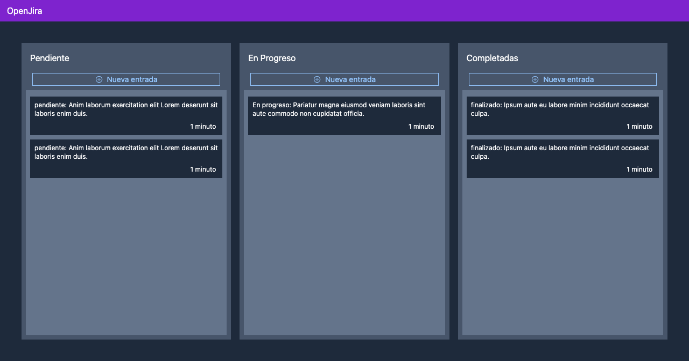

# Open Jira



## Configurar las variables de entorno
Duplicar el archivo __.env.example__ a __.env__
* MongoDB URL Local:
##### ej: mongodb+srv://<username>:<password>@cluster0.sbgyl.mongodb.net/<database>?retryWrites=true&w=majority
```
MONGO_URL=
```

* Reconstruir los módulos de node y levantar Next
```
yarn o npm i
yarn dev o npm run dev
```

## Llenar la base de datos con información de pruebas

Llamara:
```
http://localhost:3000/api/seed
```

## Para llevar a producción

Llamara:
```
yarn build o npm run build
yarn start o npm run start
```